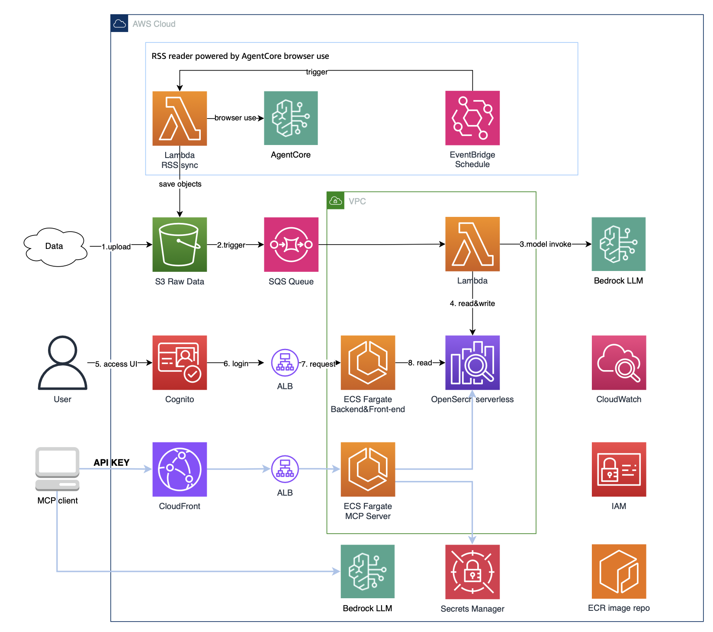

# Intelligent Insights Extraction

[](https://opensource.org/licenses/MIT-0)
[](https://www.python.org/downloads/)
[](https://aws.amazon.com/cdk/)

A serverless platform that automatically processes content from various sources, extracts insights using AI, and makes them searchable through a web interface.

## What It Does

This system takes unstructured content (HTML files, documents, etc.), analyzes it with large language models, and stores the results in a searchable database. It's built entirely on AWS managed services, so there's no infrastructure to maintain.

The platform includes:
- Automated content processing pipeline
- RSS feed monitoring with browser automation
- AI-powered insight extraction using AWS Bedrock
- Vector search with OpenSearch Serverless
- Web UI with authentication
- MCP server for programmatic access

## Architecture



### How It Works

**Manual Upload Flow:**
1. Upload content to S3 (HTML files, documents, etc.)
2. S3 triggers a Lambda function via SQS queue
3. Lambda processes the content:
   - Extracts text and metadata
   - Calls AWS Bedrock for AI analysis
   - Generates embeddings for semantic search
4. Results are stored in OpenSearch Serverless
5. Access insights through the web UI or MCP server

**Automated RSS Collection Flow:**
1. EventBridge triggers RSS sync Lambda every 15 minutes
2. Lambda fetches RSS feeds and identifies new articles
3. Uses Playwright browser automation to render and scrape pages
4. Downloads HTML, screenshots, and images to S3
5. S3 events trigger the same processing pipeline as manual uploads

The system uses event-driven architecture, so everything happens automatically.

## Quick Start

### Prerequisites

- AWS CLI configured with appropriate credentials
- Node.js 22+ and npm
- Python 3.12+
- Docker
- AWS CDK CLI: `npm install -g aws-cdk`

**Important**: Before deploying, go to AWS Bedrock Console → Model access → Request access for the models you plan to use (e.g., Claude, Cohere, Nova).

### Installation

1. Clone and set up the environment:
```bash
git clone <repository-url>
cd intelligent-insights-collector
python3 -m venv .env
source .env/bin/activate
```

2. Configure your deployment in `.projenrc.py`:
```python
setting = {
    "project_name": "insights-test",
    "stage": "dev",
    "model_embedding": "cohere.embed-multilingual-v3",
    "model_extraction": "us.anthropic.claude-3-7-sonnet-20250219-v1:0",
    "model_embedding_dimensions": "1024",
    "log_level": "DEBUG"
}
```

If you don't have access to Claude 3.7 Sonnet, use Amazon Nova instead:
```python
"model_extraction": "us.amazon.nova-pro-v1:0",
"model_embedding": "amazon.titan-embed-text-v2:0",
```

3. Build the project:
```bash
pip3 install -r requirements.txt
npx projen
npx projen build
```

This will create the necessary Lambda layers automatically.

### Deploy to AWS

1. Bootstrap CDK (first time only):
```bash
cdk bootstrap
```

2. Deploy the stack:
```bash
cdk deploy
```

The deployment takes about 10-15 minutes. When it completes, note the outputs:
- S3 bucket name (for uploading content)
- CloudFront URL (for accessing the web UI)
- MCP server URL and API key secret name (for programmatic access)

### Upload Test Data

The system expects content in a specific directory structure:

```
your-content/
├── article-1/
│   ├── article.html
│   ├── metadata.json
│   └── images/
│       └── image1.jpg
└── article-2/
    ├── article.html
    └── metadata.json
```

Example `metadata.json`:
```json
{
  "original_url": "https://example.com/article",
  "title": "Article Title",
  "author": "Author Name",
  "date": "2024-01-15",
  "download_time": "2024-01-15T10:30:00.000",
  "folder_name": "article-1",
  "images": [
    {
      "original_url": "https://example.com/image.jpg",
      "local_path": "images/image1.jpg",
      "size": 143530
    }
  ]
}
```

Use the provided upload script:
```bash
# Edit tests/upload_to_s3.py and set your bucket name
python tests/upload_to_s3.py
```

The script uploads all files except `metadata.json` first, then uploads the metadata files to trigger processing.

### Access the Web UI

Open the CloudFront URL from the deployment outputs. You'll need to create an account through AWS Cognito (the sign-up page will appear on first visit).

## Automated Content Collection

The system includes an RSS sync feature that automatically scrapes content from RSS feeds on a schedule.

### How It Works

1. **EventBridge Scheduler**: Triggers the RSS sync Lambda every 15 minutes (configurable)
2. **RSS Feed Processing**: Lambda fetches RSS feeds and identifies new articles
3. **Browser Automation**: Uses Playwright via AWS Bedrock AgentCore to render pages
4. **Content Extraction**: Downloads HTML, takes screenshots, and extracts images
5. **S3 Upload**: Stores everything in S3, triggering the same processing pipeline as manual uploads

### Configure RSS Feeds

Edit `infrastructure/main.py` to add or modify RSS feeds:

```python
schedule_rule = events.Rule(
    self,
    "ScheduledLambdaRule",
    schedule=events.Schedule.rate(Duration.minutes(15)),  # Adjust frequency
)

# Add RSS feed targets
schedule_rule.add_target(
    targets.LambdaFunction(
        self.rss_sync_function,
        event=events.RuleTargetInput.from_object({
            "rss_feed_url": "https://example.com/feed/",
            "hours_back": 24,           # Only process articles from last 24 hours
            "download_images": True,    # Download images from articles
        }),
    )
)
```

The default configuration includes three sample RSS feeds:
- Business of Fashion
- Fashion Bomb Daily  
- The Western Outfitters Blog

### RSS Feed Parameters

- `rss_feed_url`: URL of the RSS feed to monitor
- `hours_back`: Only process articles published within this many hours (default: 24)
- `download_images`: Whether to download images from articles (default: true)

### How Articles Are Stored

Each article is stored with a unique hash based on its URL to avoid duplicates:

```
s3://your-bucket/
└── example.com/
    └── abc123def456/          # URL hash
        ├── article.html       # Full HTML content
        ├── screenshot.png     # Page screenshot
        ├── metadata.json      # Article metadata
        └── images/            # Downloaded images
            ├── image1.jpg
            └── image2.jpg
```

The system automatically skips articles that have already been processed.

### Monitoring

Check CloudWatch Logs for the RSS sync Lambda to monitor:
- Feed processing status
- Articles discovered and downloaded
- Any errors or skipped articles

### Making Changes

After modifying RSS feed configurations in `infrastructure/main.py`, redeploy:
```bash
cdk deploy
```

The changes will take effect immediately, and the next scheduled run will use the new configuration.


## MCP Server

The platform includes an MCP (Model Context Protocol) server that provides programmatic access to search and retrieve insights.

### Testing the MCP Server

1. Get your API credentials from the deployment outputs:
   - MCP server URL (CloudFront distribution)
   - API key secret name (stored in AWS Secrets Manager)

2. Update `tests/test_mcp.py` with your values:
```python
client_cloudfront_url = "https://your-cloudfront-url.cloudfront.net/mcp/"
secret_name = "MCPServerAPIKey-xxxxx"
```

3. Run the test:
```bash
source .env/bin/activate
pip install mcp strands-agents strands-agents-tools
python3 tests/test_mcp.py
```

The MCP server supports semantic search with industry filtering and AI-powered result ranking.

## Customization

### Modifying AI Prompts

Edit `src/lambdas/idea_extraction/prompt.py` to customize how content is analyzed. The default prompt is in `DEFAULT_PROMPT`. You can also configure URL-specific prompts in `url_prompt_matching`.

After changes, redeploy:
```bash
cdk deploy
```

### HTML Processing

Large HTML files are preprocessed to avoid token limits:
- Files < 1MB: Processed with `@mozilla/readability`
- Files > 1MB: Processed with `html-to-text`

Adjust the logic in `src/lambdas/idea_extraction/common/html_processor.py` if needed.

### SQS Configuration

Tune the processing pipeline in `infrastructure/main.py`:

```python
sqs_event_source = lambda_events.SqsEventSource(
    queue,
    batch_size=10,           # Messages per Lambda invocation
    max_concurrency=10,      # Concurrent Lambda executions
    max_batching_window=Duration.seconds(5),
    report_batch_item_failures=True,
)
```

Adjust based on your workload:
- **High throughput**: Increase `batch_size` and `max_concurrency`
- **Low latency**: Decrease `batch_size` and `max_batching_window`
- **Database limits**: Lower `max_concurrency` to avoid overwhelming connections

## Project Structure

```
├── infrastructure/          # CDK infrastructure definitions
│   ├── main.py             # Main stack with Lambda, S3, SQS
│   ├── opensearch_serverless.py
│   ├── insights_hub.py     # ECS web application
│   ├── cognito.py          # Authentication
│   └── mcp_server.py       # MCP server setup
├── src/
│   ├── ecs/
│   │   ├── insights_hub/   # Web UI (React + FastAPI)
│   │   └── mcp_server_ideas/
│   ├── lambdas/
│   │   ├── idea_extraction/  # Main processing logic
│   │   ├── html_readability/
│   │   └── rss_sync/
│   └── lambda_layers/
├── docs/                   # Documentation and diagrams
├── tests/                  # Test scripts
└── .projenrc.py           # Project configuration
```

## Notes

- **OpenSearch indexing**: New data appears in search results within ~60 seconds due to the refresh interval
- **Large files**: HTML files over 1MB are automatically simplified to avoid token limits
- **VPC limits**: Check your AWS VPC quota before deploying (default is 5 per region)
- **Costs**: This uses Lambda, S3, SQS, Bedrock, OpenSearch Serverless, and ECS - monitor your usage

## Security

- VPC isolation for database resources
- S3 encryption and SSL enforcement
- Least-privilege IAM roles
- Secrets Manager for credentials
- Cognito for user authentication
- Dead letter queue for failed messages

For production deployments, consider:
- Adding AWS WAF to CloudFront
- Implementing email domain validation for user registration
- Adjusting CloudWatch log retention to reduce costs

## Documentation

- [Data Schema](docs/data_schema.md) - Database structure and field definitions
- [EC2 Setup Guide](docs/ec2_prerequisites_setup.md) - Setting up prerequisites on EC2
- [Prototype Report](docs/PrototypeReport.md) - Detailed project documentation

## Contributing

Contributions are welcome! Feel free to open issues or submit pull requests.

## License

MIT-0

